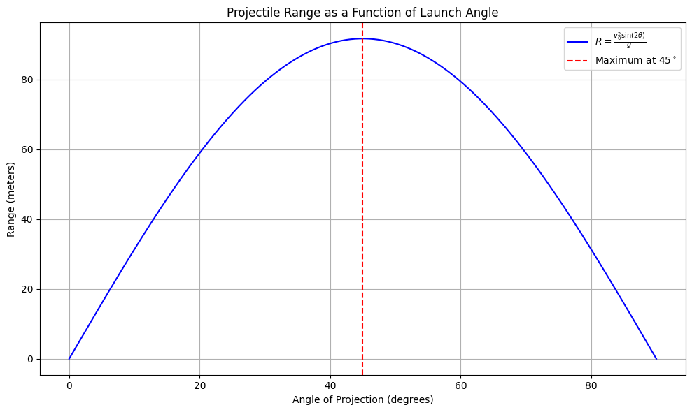

# Investigating the Range as a Function of the Angle of Projection

---

## 1. Theoretical Foundation:

Projectile motion refers to the motion of an object that is projected into the air under the influence of gravity, without any air resistance. The basic principles of projectile motion can be derived from Newton's second law and the kinematic equations.

For simplicity, let's assume the projectile is launched from the origin \((x = 0, y = 0)\), with an initial velocity \(v_0\) at an angle \(\theta\) from the horizontal. The only force acting on the projectile is gravity, which accelerates the object downward with an acceleration of \(g = 9.81 \, m/s^2\) (on Earth).

### Equations of Motion:

We can break the motion into horizontal and vertical components. 

#### Horizontal motion (no acceleration):
\[
x(t) = v_0 \cos(\theta) \cdot t
\]
where \(x(t)\) is the horizontal displacement at time \(t\), \(v_0\) is the initial velocity, and \(\theta\) is the launch angle.

#### Vertical motion (under acceleration due to gravity):
\[
y(t) = v_0 \sin(\theta) \cdot t - \frac{1}{2} g t^2
\]
where \(y(t)\) is the vertical displacement at time \(t\), and \(g\) is the gravitational acceleration.

The time of flight \(T\) (the time it takes for the projectile to hit the ground) can be found by setting \(y(T) = 0\). Using the vertical motion equation:

\[
0 = v_0 \sin(\theta) \cdot T - \frac{1}{2} g T^2
\]

Solve for \(T\):

\[
T = \frac{2 v_0 \sin(\theta)}{g}
\]

#### Range (R):
The range of the projectile is the horizontal distance it travels before hitting the ground. Using the time of flight \(T\) from above, the range \(R\) is:

\[
R = x(T) = v_0 \cos(\theta) \cdot T
\]

Substituting for \(T\):

\[
R = \frac{v_0^2 \sin(2\theta)}{g}
\]

This equation is fundamental to understanding how the range of a projectile depends on the launch angle. The range is maximized when \(\sin(2\theta) = 1\), which occurs at \(\theta = 45^\circ\).

---

## 2. Analysis of the Range:

### Dependence of Range on the Launch Angle:
The range \(R\) as a function of the launch angle \(\theta\) is given by:

\[
R(\theta) = \frac{v_0^2 \sin(2\theta)}{g}
\]

- **For small angles** (\(\theta \to 0\)), the sine term \(\sin(2\theta) \to 0\), so the range is very short.
- **At \(\theta = 45^\circ\)**, \(\sin(2\theta)\) reaches its maximum value of 1, giving the maximum range for a given initial velocity.
- **For large angles** (\(\theta \to 90^\circ\)), the sine term again approaches 0, reducing the range.

### Influence of Other Parameters:

- **Initial Velocity (\(v_0\))**: The range is proportional to the square of the initial velocity. A higher launch velocity increases the range.
  
- **Gravitational Acceleration (\(g\))**: The range is inversely proportional to \(g\). In regions with lower gravitational acceleration (such as the Moon or Mars), the range for the same initial velocity will be larger than on Earth.

- **Launch Height**: The equations above assume the projectile is launched from the ground. If the launch height is above the ground (such as from a cliff), the projectile will stay in the air longer, increasing the range.

---

## 3. Practical Applications:

This basic model of projectile motion can be extended to various real-world scenarios. Some examples include:

- **Sports**: In sports like soccer, basketball, or golf, athletes often aim to maximize the range of their projectiles (e.g., a soccer ball or golf ball). The optimal launch angle is approximately 45 degrees, though factors like air resistance and spin affect the actual range.
  
- **Engineering**: Engineers designing missile trajectories must consider not only the angle of launch but also the effects of wind resistance, aerodynamic forces, and changes in the Earth's curvature.

- **Astrophysics**: In space exploration, the launch angle of rockets can affect the trajectory and distance traveled, and the equations may need to be adapted to account for the vacuum of space and gravitational influences from other celestial bodies.

#### Uneven Terrain & Air Resistance:
The basic model assumes a flat Earth and neglects air resistance. In real-world applications, these factors can significantly alter the trajectory:

- **Uneven Terrain**: If the projectile is launched on uneven terrain (e.g., from a hill), the initial height must be taken into account, which changes the equations for time of flight and range.
  
- **Air Resistance**: The presence of air resistance complicates the equations, as the drag force acting on the projectile depends on its velocity, shape, and the properties of the air. This would result in a non-parabolic trajectory.

---

## 4. Implementation:

Now let's implement a Python simulation to visualize the range of a projectile as a function of the launch angle, considering different initial velocities.

```python
import numpy as np
import matplotlib.pyplot as plt

# Constants
g = 9.81  # gravitational acceleration (m/s^2)

def range_of_projectile(v0, angle):
    """
    Calculate the range of a projectile launched with an initial velocity `v0` at an angle `angle`.
    """
    angle_rad = np.radians(angle)
    return (v0 ** 2 * np.sin(2 * angle_rad)) / g

# Parameters
v0_values = [10, 20, 30]  # different initial velocities (m/s)
angles = np.linspace(0, 90, 100)  # angles from 0 to 90 degrees

# Plotting
plt.figure(figsize=(10, 6))

for v0 in v0_values:
    ranges = [range_of_projectile(v0, angle) for angle in angles]
    plt.plot(angles, ranges, label=f'v0 = {v0} m/s')

plt.title("Range of a Projectile as a Function of Launch Angle")
plt.xlabel("Launch Angle (degrees)")
plt.ylabel("Range (meters)")
plt.legend()
plt.grid(True)
plt.show()


```


