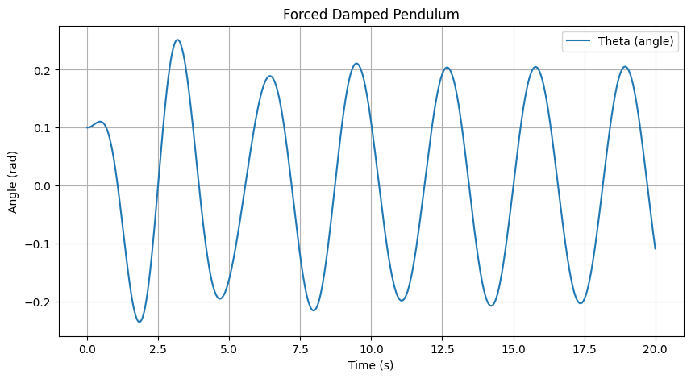

# Problem 2
# Investigating the Dynamics of a Forced Damped Pendulum

## Motivation

The forced damped pendulum is a captivating example of a physical system with intricate behavior resulting from the interplay of damping, restoring forces, and external driving forces. By introducing both damping and external periodic forcing, the system demonstrates a transition from simple harmonic motion to a rich spectrum of dynamics, including resonance, chaos, and quasiperiodic behavior. These phenomena serve as a foundation for understanding complex real-world systems, such as driven oscillators, climate systems, and mechanical structures under periodic stress.

Adding forcing introduces new parameters, such as the amplitude and frequency of the external force, which significantly affect the pendulum's behavior. By systematically varying these parameters, a diverse class of solutions can be observed, including synchronized oscillations, chaotic motion, and resonance phenomena. These behaviors not only highlight fundamental physics principles but also provide insights into engineering applications such as energy harvesting, vibration isolation, and mechanical resonance.

## Task

### 1. Theoretical Foundation
- Start with the differential equation governing the motion of a forced damped pendulum:
  
\[
\frac{d^2\theta}{dt^2} + b \frac{d\theta}{dt} + \frac{g}{L} \sin(\theta) = A \cos(\omega t)
\]


- Derive the approximate solutions for small-angle oscillations.
- Explore resonance conditions and their implications for the system's energy.

### 2. Analysis of Dynamics
- Investigate how the damping coefficient, driving amplitude, and driving frequency influence the motion of the pendulum.
- Examine the transition between regular and chaotic motion and their physical interpretations.

### 3. Practical Applications
- Discuss real-world scenarios where the forced damped pendulum model applies, such as in energy harvesting devices, suspension bridges, and oscillating circuits.

### 4. Implementation
- Create a computational model to simulate the motion of a forced damped pendulum.
- Visualize the behavior under various damping, driving force, and initial conditions.
- Plot phase diagrams and Poincaré sections to illustrate transitions to chaos.

## Solution Approach

### 1. Small-Angle Approximation

For small angles, we can approximate \( \sin\theta \approx \theta \). This leads to the simplified equation for the motion of the pendulum:

\[
\frac{d^2\theta}{dt^2} + b \frac{d\theta}{dt} + \frac{g}{L} \theta = A \cos(\omega t)
\]

This is a linear second-order non-homogeneous differential equation. We can solve it in two parts:

- The **homogeneous solution** \( \theta_h(t) \) solves the equation without the external forcing term:

  \frac{d^2 \theta}{dt^2} + b \frac{d \theta}{dt} + \frac{g}{L} \theta = 0


  The solution for the homogeneous equation depends on the damping condition:
  - **Underdamped**: \( b^2 < 4m\frac{g}{L} \) (exponentially decaying oscillations)
  - **Critically damped**: \( b^2 = 4m\frac{g}{L} \)
  - **Overdamped**: \( b^2 > 4m\frac{g}{L} \) (no oscillations, just exponential decay)

- The **particular solution** \( \theta_p(t) \) is driven by the external periodic force \( A \cos(\omega t) \). This can be found using a method like **undetermined coefficients**:

  \theta_p(t) = \frac{A}{\sqrt{\left(\frac{g}{L} - \omega^2\right)^2 + (b\omega)^2}} \cos(\omega t - \phi)


  where \( \phi \) is a phase shift dependent on the system's parameters.

Thus, the total solution for small-angle oscillations is the sum of the homogeneous and particular solutions:

\[
\theta(t) = C_1 e^{\lambda_1 t} + C_2 e^{\lambda_2 t} + \frac{A}{\sqrt{(\frac{g}{L} - \omega^2)^2 + (b\omega)^2}} \cos(\omega t - \phi)
\]

### 2. **Resonance Condition**

The system reaches resonance when the frequency of the driving force matches the natural frequency of the system, which is given by:

\[
\omega_0 = \sqrt{\frac{g}{L}}
\]

At resonance, the system can oscillate with maximum amplitude if the damping is not too large. The condition for resonance is:

\[
\omega = \omega_0
\]

When this condition is met, even a small driving force can result in large oscillations, especially if the damping is low.

### 3. **Analysis of Dynamics**

#### a) **Influence of Damping**:

The damping term \( b \) directly affects how quickly the system loses energy. High damping results in the system reaching equilibrium faster, while low damping allows for longer oscillations before the motion dies out. The transition from underdamped to overdamped behavior is particularly important for understanding resonance phenomena.

#### b) **Driving Amplitude and Frequency**:
- **Amplitude \( A \)**: Larger driving forces lead to larger oscillations, but can also push the system into chaotic regimes if the parameters are favorable.
- **Frequency \( \omega \)**: The frequency of the driving force determines whether the system oscillates at resonance, which can lead to large-amplitude oscillations, or at other frequencies, which can result in more complex behaviors.

### 4. **Numerical Solution for Arbitrary Angles**

For larger angles, where the small-angle approximation doesn't hold, we need to numerically solve the full nonlinear differential equation:

\[
\frac{d^2\theta}{dt^2} + b \frac{d\theta}{dt} + \frac{g}{L} \sin\theta = A \cos(\omega t)
\]

We will implement this equation using the **Runge-Kutta method** to obtain numerical solutions for arbitrary initial conditions, driving forces, and damping.

### 5. **Phase Diagram and Poincaré Sections**

For a more detailed analysis, you can plot phase diagrams and Poincaré sections to visualize transitions to chaotic motion. A phase diagram shows the trajectory of the system in phase space (angle vs. angular velocity), while a Poincaré section slices the trajectory at regular intervals, helping to identify periodic or chaotic behavior.

---


#### Python Code:
```python
import numpy as np
import matplotlib.pyplot as plt
from scipy.integrate import solve_ivp

# Parameters
g = 9.81  # Gravity (m/s^2)
L = 1.0   # Length of the pendulum (m)
b = 0.5   # Damping coefficient
A = 1.2   # Driving force amplitude
omega = 2.0  # Driving force frequency

# Differential equations
def pendulum(t, y):
    theta, omega_dot = y
    dtheta_dt = omega_dot
    domega_dt = -b * omega_dot - (g / L) * np.sin(theta) + A * np.cos(omega * t)
    return [dtheta_dt, domega_dt]

# Time span and initial conditions
t_span = (0, 50)
t_eval = np.linspace(*t_span, 1000)
y0 = [0.1, 0]  # Initial angle and velocity

# Solve the system
sol = solve_ivp(pendulum, t_span, y0, t_eval=t_eval, method='RK45')

# Plot results
plt.figure(figsize=(10, 5))
plt.plot(sol.t, sol.y[0], label='Theta (rad)')
plt.xlabel('Time (s)')
plt.ylabel('Angle (rad)')
plt.title('Forced Damped Pendulum')
plt.legend()
plt.grid()
plt.show()
```


```