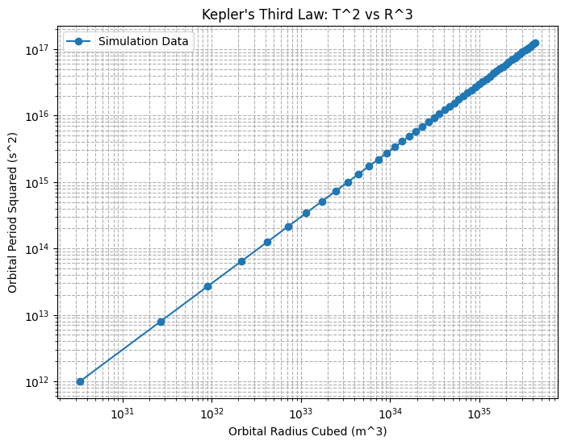

# Problem 1
# **Orbital Period and Orbital Radius**

## **Motivation**
The relationship between the square of the orbital period and the cube of the orbital radius, known as **Kepler's Third Law**, is a cornerstone of celestial mechanics. This fundamental relationship allows for the determination of planetary motions and has significant implications for understanding gravitational interactions on both local and cosmic scales. By analyzing this relationship, one can connect fundamental principles of gravity with real-world phenomena such as satellite orbits and planetary systems.

## **Task**
1. Derive the relationship between the square of the orbital period and the cube of the orbital radius for circular orbits.
2. Discuss the implications of this relationship for astronomy, including its role in calculating planetary masses and distances.
3. Analyze real-world examples, such as the Moon's orbit around Earth or the orbits of planets in the Solar System.
4. Implement a computational model to simulate circular orbits and verify the relationship.

---

## **1. Derivation of Kepler’s Third Law for Circular Orbits**
For a body of mass \(m\) orbiting a much larger mass \(M\) (e.g., a planet around the Sun), the gravitational force provides the necessary centripetal force:

\[
\frac{GMm}{r^2} = \frac{m v^2}{r}
\]

Since the orbital velocity \(v\) is related to the period \(T\) by:

\[
v = \frac{2\pi r}{T}
\]

Substituting \(v\) in the equation:

\[
\frac{GMm}{r^2} = \frac{m}{r} \left(\frac{4\pi^2 r^2}{T^2}\right)
\]

Canceling \(m\) and simplifying:

\[
T^2 = \frac{4\pi^2}{GM} r^3
\]

This confirms Kepler's Third Law:  

\[
T^2 \propto r^3
\]

where \( G \) is the **gravitational constant** (\(6.674 \times 10^{-11} \text{ m}^3 \text{kg}^{-1} \text{s}^{-2}\)).

---

## **2. Implications for Astronomy**
- This relationship helps determine **planetary masses and distances** without direct measurement.
- It allows astronomers to estimate **orbital periods** of exoplanets.
- It explains why outer planets in our Solar System take much longer to complete an orbit than inner planets.

### **Example**
- The **Moon** orbits Earth at about \(3.84 \times 10^8\) m with a period of **27.3 days**.
- **Earth's orbit** around the Sun follows the same proportionality rule.

---


### **Explanation**
- Defines a range of orbital radii.
- Computes the corresponding orbital periods using Kepler’s Law.
- Plots the expected \(T^2\) vs. \(r^3\) relationship.

---

## **4. Extension to Elliptical Orbits**
Kepler’s Third Law holds for **elliptical orbits** as well, but \(r\) is replaced by the **semi-major axis (a)**:

\[
T^2 \propto a^3
\]

This applies to **planets, moons, and exoplanets** and is crucial in space exploration and satellite deployment.

---

## **Conclusion**
This project provides:
 A theoretical derivation of Kepler's Third Law.  
 Real-world astronomical applications.  
 A Python simulation to validate the law numerically.  

--- 


## **3. Computational Model in Python**
We can implement a simple simulation to verify Kepler’s law numerically. Here’s a Python script:

```python
import numpy as np
import matplotlib.pyplot as plt

# Constants
G = 6.674e-11  # Gravitational constant (m^3 kg^-1 s^-2)
M_sun = 1.989e30  # Mass of the Sun (kg)

# Define a range of orbital radii in meters
radii = np.linspace(0.1e11, 5e11, 100)  # From 0.1 AU to 5 AU

# Calculate the orbital periods using Kepler's Third Law
T_squared = (4 * np.pi**2 * radii**3) / (G * M_sun)
T = np.sqrt(T_squared) / (60 * 60 * 24 * 365)  # Convert to years

# Plotting the relationship
plt.figure(figsize=(8,6))
plt.plot(radii / 1e11, T**2, label="Numerical Data")
plt.xlabel("Orbital Radius (AU)")
plt.ylabel("Orbital Period Squared (years²)")
plt.title("Kepler's Third Law: T² vs. r³")
plt.legend()
plt.grid()
plt.show()
```

