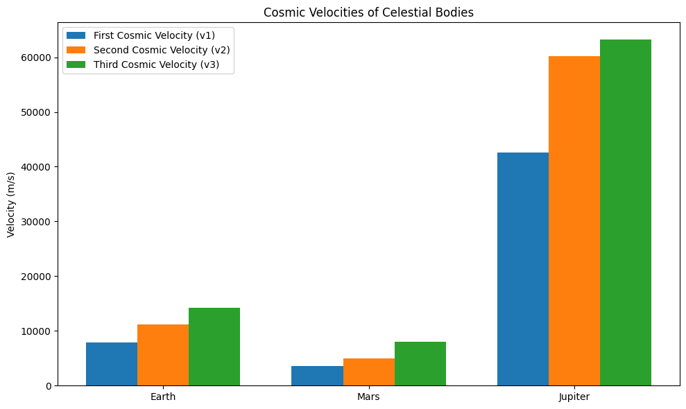

# Escape Velocities and Cosmic Velocities

---

## Motivation:
Understanding escape velocity is essential for determining the minimum speed required to break free from a celestial body's gravitational pull. The concept extends further with the introduction of the **first, second, and third cosmic velocities**, which are key for orbiting a body, escaping it, or leaving an entire star system, respectively. These principles are foundational for **modern space exploration**, including satellite launches, interplanetary missions, and the potential future of interstellar travel.

---

## Definitions of Cosmic Velocities:

1. **First Cosmic Velocity (v1)**:  
   This is the **orbital velocity** required to keep an object in a stable circular orbit around a celestial body. It represents the speed at which an object must travel to balance the gravitational pull of the body.

   - **Formula**:  
     \[
     v_1 = \sqrt{\frac{GM}{R}}
     \]
     Where:
     - \( G \) = Gravitational constant (\( 6.67430 \times 10^{-11} \, \text{m}^3 \, \text{kg}^{-1} \, \text{s}^{-2} \))
     - \( M \) = Mass of the celestial body
     - \( R \) = Radius of the celestial body

2. **Second Cosmic Velocity (v2)**:  
   This is the **escape velocity**, the speed required to escape the gravitational pull of the celestial body without any further propulsion.

   - **Formula**:  
     \[
     v_2 = \sqrt{2} \times v_1
     \]
     Which means the escape velocity is roughly 1.414 times the orbital velocity.

3. **Third Cosmic Velocity (v3)**:  
   This is the **velocity required to escape the gravitational influence of the central star** (e.g., the Sun), starting from the surface of a planet. It’s roughly the escape velocity of the body added to a small additional speed to ensure a path out of the star system.

   - **Formula**:  
     For simplification, we estimate the third cosmic velocity as:
     \[
     v_3 = v_2 + 3000 \, \text{m/s}
     \]
     The value 3000 m/s is added as a rough estimate of the additional speed required for heliocentric escape.

---

## Mathematical Derivations & Parameters Affecting Velocities:

The escape velocities are influenced by:
- **Mass of the celestial body (M)**: Larger mass increases the velocity required to escape or orbit.
- **Radius of the celestial body (R)**: A larger radius leads to a lower escape velocity, as gravitational pull weakens with distance.

The formulas for these velocities are derived from Newton's law of gravitation and the principles of orbital mechanics. The gravitational force must equal the centripetal force for orbital velocity, and for escape velocity, the energy required to escape must be equal to the initial kinetic energy of the object.

---

