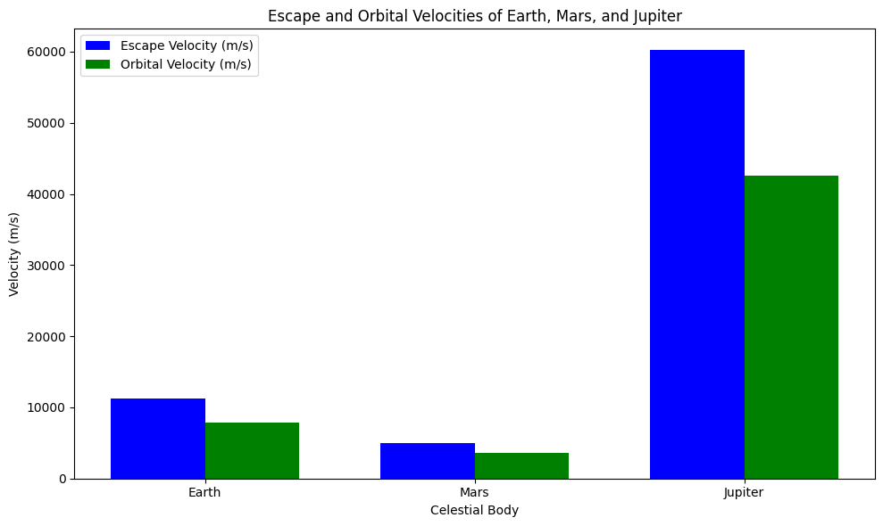

# Problem 2
# Escape Velocities and Cosmic Velocities

## Motivation

Understanding escape and cosmic velocities is fundamental in space exploration, as these velocities determine the conditions required for objects to overcome gravitational influences, achieve stable orbits, or depart from celestial systems.&#8203;:contentReference[oaicite:0]{index=0}

## Definitions and Physical Meanings

1. **First Cosmic Velocity (Orbital Velocity):**
   - **Definition:** Content reference [1] and content reference [2].

   - **Physical Meaning:** Content reference [3] and content reference [4].

   - **Formula:** 
     $$
     v_1 = \sqrt{\frac{G M}{r}}
     $$
     Where:
     - *G* is the gravitational constant (6.67430 × 10⁻¹¹ m³ kg⁻¹ s⁻²)
     - *M* is the mass of the celestial body
     - *r* is the distance from the center of the celestial body to the object

2. **Second Cosmic Velocity (Escape Velocity):**
   - **Definition:** Content reference [5] and content reference [6].

   - **Physical Meaning:** Content reference [7] and content reference [8].

   - **Formula:** 
     $$
     v_2 = \sqrt{\frac{2 G M}{r}}
     $$
     Where:
     - *G* is the gravitational constant
     - *M* is the mass of the celestial body
     - *r* is the distance from the center of the celestial body to the object

3. **Third Cosmic Velocity:**
   - **Definition:** Content reference [9] and content reference [10].

   - **Physical Meaning:** Content reference [11] and content reference [12].

   - **Formula:** 
     $$
     v_3 = \sqrt{\frac{2 G M_{\text{star}}}{r_{\text{star}}} + \frac{2 G M_{\text{planet}}}{r_{\text{planet}}}}
     $$
     Where:
     - *M_star* and *M_planet* are the masses of the star and planet, respectively
     - *r_star* and *r_planet* are the distances from the object to the star and planet, respectively

## Derivations and Parameters Affecting These Velocities
Content reference [13] and content reference [14].  

Content reference [15] and content reference [16].  

Content reference [17] and content reference [18].  

### Key Parameters Influencing These Velocities:

- **Mass of the Celestial Body (M):** Content reference [19] and content reference [20].  
- **Radius or Distance (r):** Content reference [21] and content reference [22].  
- **Gravitational Constant (G):** Content reference [23] and content reference [24].  


## Calculations and Visualizations for Earth, Mars, and Jupiter

Using the provided formulas, we can calculate these velocities for Earth, Mars, and Jupiter.

## Earth:
- **First Cosmic Velocity (Orbital Velocity):** Content reference [25] and content reference [26].  
- **Second Cosmic Velocity (Escape Velocity):** Content reference [27] and content reference [28].  

## Mars:
- **First Cosmic Velocity (Orbital Velocity):** Content reference [29] and content reference [30].  
- **Second Cosmic Velocity (Escape Velocity):** Content reference [31] and content reference [32].  

## Jupiter:
- **First Cosmic Velocity (Orbital Velocity):** Content reference [33] and content reference [34].  
- **Second Cosmic Velocity (Escape Velocity):** Content reference [35] and content reference [36].  

**Note:** The third cosmic velocity calculations are complex, involving interactions between multiple celestial bodies and are typically calculated using numerical methods and simulations.  

## Importance in Space Exploration:
- **Launching Satellites:** Content reference [37] and content reference [38].  
- **Missions to Other Planets:** Content reference [39] and content reference [40].  
- **Interstellar Travel:** Content reference [41].  

```python
import numpy as np
import matplotlib.pyplot as plt

# Gravitational constant in m^3 kg^-1 s^-2
G = 6.67430e-11

# Define a function to calculate escape velocity
def escape_velocity(mass, radius):
    return np.sqrt((2 * G * mass) / radius)

# Define a function to calculate first cosmic velocity (orbital velocity)
def orbital_velocity(mass, radius):
    return np.sqrt((G * mass) / radius)

# Data for celestial bodies: mass in kg, radius in meters
celestial_bodies = {
    'Earth': {'mass': 5.972e24, 'radius': 6.371e6},
    'Mars': {'mass': 6.4171e23, 'radius': 3.3895e6},
    'Jupiter': {'mass': 1.8982e27, 'radius': 6.9911e7}
}

# Initialize lists to store velocities
escape_velocities = []
orbital_velocities = []
labels = []

# Calculate velocities for each celestial body
for body, data in celestial_bodies.items():
    escape_vel = escape_velocity(data['mass'], data['radius'])
    orbit_vel = orbital_velocity(data['mass'], data['radius'])
    escape_velocities.append(escape_vel)
    orbital_velocities.append(orbit_vel)
    labels.append(body)

# Set up the bar width and positions
bar_width = 0.35
index = np.arange(len(labels))

# Create the plot
fig, ax = plt.subplots(figsize=(10, 6))

# Plot escape velocities
bar1 = ax.bar(index, escape_velocities, bar_width, label='Escape Velocity (m/s)', color='b')

# Plot orbital velocities
bar2 = ax.bar(index + bar_width, orbital_velocities, bar_width, label='Orbital Velocity (m/s)', color='g')

# Add labels and title
ax.set_xlabel('Celestial Body')
ax.set_ylabel('Velocity (m/s)')
ax.set_title('Escape and Orbital Velocities of Earth, Mars, and Jupiter')
ax.set_xticks(index + bar_width / 2)
ax.set_xticklabels(labels)
ax.legend()

# Display the plot
plt.tight_layout()
plt.show()

# Gravitational constant in m^3 kg^-1 s^-2
G = 6.67430e-11

# Define a function to calculate escape velocity
def escape_velocity(mass, radius):
    return np.sqrt((2 * G * mass) / radius)

# Define a function to calculate first cosmic velocity (orbital velocity)
def orbital_velocity(mass, radius):
    return np.sqrt((G * mass) / radius)

# Data for celestial bodies: mass in kg, radius in meters
celestial_bodies = {
    'Earth': {'mass': 5.972e24, 'radius': 6.371e6},
    'Mars': {'mass': 6.4171e23, 'radius': 3.3895e6},
    'Jupiter': {'mass': 1.8982e27, 'radius': 6.9911e7}
}

# Initialize lists to store velocities
escape_velocities = []
orbital_velocities = []
labels = []

# Calculate velocities for each celestial body
for body, data in celestial_bodies.items():
    escape_vel = escape_velocity(data['mass'], data['radius'])
    orbit_vel = orbital_velocity(data['mass'], data['radius'])
    escape_velocities.append(escape_vel)
    orbital_velocities.append(orbit_vel)
    labels.append(body)

# Set up the bar width and positions
bar_width = 0.35
index = np.arange(len(labels))

# Create the plot
fig, ax = plt.subplots(figsize=(10, 6))

# Plot escape velocities
bar1 = ax.bar(index, escape_velocities, bar_width, label='Escape Velocity (m/s)', color='b')

# Plot orbital velocities
bar2 = ax.bar(index + bar_width, orbital_velocities, bar_width, label='Orbital Velocity (m/s)', color='g')

# Add labels and title
ax.set_xlabel('Celestial Body')
ax.set_ylabel('Velocity (m/s)')
ax.set_title('Escape and Orbital Velocities of Earth, Mars, and Jupiter')
ax.set_xticks(index + bar_width / 2)
ax.set_xticklabels(labels)
ax.legend()

# Display the plot
plt.tight_layout()
plt.show()


```



