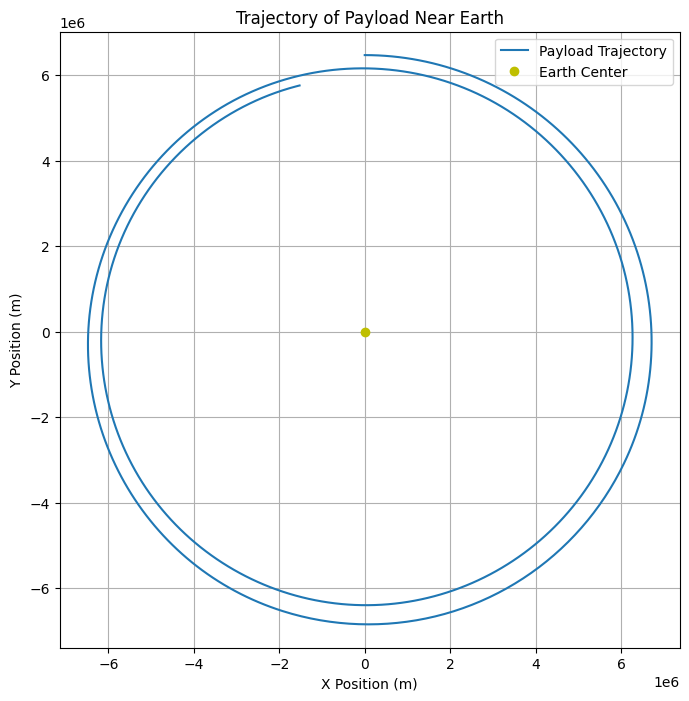

# Problem 3
# Trajectories of a Freely Released Payload Near Earth

## Motivation
When an object is released from a moving rocket near Earth, its trajectory is influenced by various factors such as initial conditions (position, velocity, and altitude) and gravitational forces. This problem combines principles of orbital mechanics and numerical methods. Understanding these trajectories is essential for space missions, such as payload deployment or controlled reentry. 

In this task, we will analyze the possible trajectories (e.g., parabolic, hyperbolic, elliptical) of a payload released near Earth, simulate these paths using numerical methods, and discuss how they relate to orbital insertion, reentry, or escape scenarios.

---

## Task Overview

### 1. **Analyze the Possible Trajectories**
The trajectories of a payload released near Earth can take various forms depending on its initial velocity and position. Some of the potential types of trajectories include:
- **Elliptical Orbits**: Objects that are bound to Earth, moving along elliptical paths.
- **Parabolic Trajectories**: Objects that have just enough velocity to escape Earth's gravitational pull but will return after completing a semi-circular path.
- **Hyperbolic Trajectories**: Objects that have excess velocity, resulting in trajectories that escape Earth's gravitational influence permanently.

### 2. **Numerical Analysis**
Using initial conditions such as position, velocity, and altitude, we will compute the trajectory of a payload. The simulation will be based on Newton's Law of Gravitation and will use numerical methods to approximate the path the payload follows under Earth's gravity.

### 3. **Relating to Space Missions**
By studying these trajectories, we can understand the dynamics involved in:
- **Orbital Insertion**: How payloads are placed into stable orbits.
- **Reentry**: How objects return to Earth and the forces they experience during the descent.
- **Escape**: How objects can escape Earth's gravitational pull and enter interplanetary orbits.

### 4. **Simulation and Visualization**
A computational tool will be developed to simulate the motion of the payload using Python. This will visualize the payload's trajectory under Earth's gravity, considering various initial velocities and directions.

---

## Key Concepts

### 1. **Newton's Law of Gravitation**
The force of gravity between two objects is given by:

\[
F = \frac{G M m}{r^2}
\]

Where:
- \(F\) is the gravitational force,
- \(G\) is the gravitational constant (\(6.674 \times 10^{-11} \, \text{m}^3 \, \text{kg}^{-1} \, \text{s}^{-2}\)),
- \(M\) is the mass of Earth,
- \(m\) is the mass of the payload,
- \(r\) is the distance between the centers of mass of the two objects.

This force will be responsible for changing the velocity of the payload as it moves.

### 2. **Kepler's Laws of Motion**
These laws describe the motion of objects under the influence of gravity:
- **First Law (Elliptical Orbits)**: All planets and objects move in elliptical orbits with the Sun (or Earth's center) at one of the foci.
- **Second Law (Equal Areas)**: A line joining a planet (or payload) and the center of Earth sweeps out equal areas during equal intervals of time, meaning that the object moves faster when closer to Earth.
- **Third Law (Orbital Period)**: The square of the orbital period is proportional to the cube of the semi-major axis of the orbit.

### 3. **Escape Velocity**
The escape velocity is the minimum speed required for an object to escape Earth's gravity without further propulsion. It is given by:

\[
v_e = \sqrt{\frac{2GM}{r}}
\]

Where \(r\) is the distance from Earth's center.

### 4. **Orbital Mechanics**
To model the motion of a payload near Earth, we will use the two-body problem, where Earth is assumed to be stationary, and the payload is influenced only by the gravitational force.

---

## Numerical Simulation

We will implement the simulation using Python. The following libraries will be used:
- `numpy` for numerical calculations
- `matplotlib` for plotting trajectories
- `scipy` for solving differential equations

The equations of motion will be numerically integrated using the **Runge-Kutta method** or **Euler's method**.

### Python Code (Jupyter Notebook)

```python
import numpy as np
import matplotlib.pyplot as plt
from scipy.integrate import solve_ivp

# Constants
G = 6.67430e-11  # Gravitational constant, m^3 kg^-1 s^-2
M = 5.972e24     # Mass of Earth, kg
R = 6371000      # Radius of Earth, meters

# Function to calculate gravitational force
def grav_force(r):
    return G * M / r**2

# Function to define the system of differential equations
def equations(t, y):
    # y[0] = x, y[1] = y, y[2] = vx, y[3] = vy (position and velocity)
    r = np.sqrt(y[0]**2 + y[1]**2)
    ax = -G * M * y[0] / r**3
    ay = -G * M * y[1] / r**3
    return [y[2], y[3], ax, ay]

# Initial conditions (position, velocity)
x0 = 0  # meters
y0 = R + 100000  # 100 km above Earth's surface
vx0 = 8000  # m/s (speed for low Earth orbit)
vy0 = 0

# Time span and evaluation points
t_span = (0, 10000)  # 10,000 seconds
t_eval = np.linspace(0, 10000, 1000)

# Initial state vector
y0_state = [x0, y0, vx0, vy0]

# Solve the differential equations
solution = solve_ivp(equations, t_span, y0_state, t_eval=t_eval)

# Deliverables

## 1. Markdown Document

### Overview of the Task and the Concepts Involved
This project focuses on analyzing the trajectories of a payload that is released near Earth. The path of the payload depends on its initial conditions (such as position, velocity, and altitude) and gravitational forces. By understanding the dynamics of these trajectories, we gain insight into various space mission scenarios, such as payload deployment, orbital insertion, reentry, and escape from Earth's gravitational pull.

The primary goal is to compute the trajectory of a payload using numerical methods, simulate its motion under the influence of gravity, and visualize different types of trajectories (e.g., parabolic, elliptical, hyperbolic).

### Detailed Explanation of the Numerical Methods and Their Application to the Problem
To compute the trajectory, we use Newton’s Law of Gravitation to determine the gravitational force acting on the payload. The system of differential equations describing the motion of the payload is solved numerically using methods such as **Euler’s method** or the **Runge-Kutta method**. These methods are used to update the position and velocity of the payload at each time step.

By integrating these equations over time, we can compute the position and velocity of the payload at each step, allowing us to plot its trajectory.

### Discussion of Various Types of Trajectories and How They Relate to Real-World Scenarios
The trajectories of the payload can fall into several categories based on its initial velocity and position:
- **Elliptical Orbits**: Objects that are bound to Earth, moving in elliptical paths. These orbits are typical for satellites and other objects in stable orbits around Earth.
- **Parabolic Trajectories**: Objects that have just enough velocity to escape Earth's gravitational pull, but they will return to Earth after completing a semi-circular path. This type of trajectory is often seen in spacecraft that enter escape trajectories but later return.
- **Hyperbolic Trajectories**: Objects that have more than enough velocity to escape Earth's gravity and continue on a path that does not return to Earth. This is typical for spacecraft that escape Earth's influence, such as interplanetary missions.

These trajectories have important implications for space missions, including satellite launches, interplanetary exploration, and the controlled reentry of space objects.


## 2. Python Script or Jupyter Notebook

### A Python Script or Jupyter Notebook Implementing the Numerical Simulation of Payload Trajectories
The Python script or Jupyter notebook will simulate the motion of the payload under Earth's gravity. It will integrate the equations of motion, updating the position and velocity at each time step. The program will include the following:
- Definition of the gravitational force and equations of motion.
- Numerical solution to the differential equations using the Runge-Kutta method (or Euler’s method).
- Calculation and plotting of the trajectory.

### Code for Plotting the Trajectory and Visualizing the Motion of the Payload
The code will include a section for plotting the trajectory of the payload as it moves under the influence of Earth's gravity. The plot will show the motion in two dimensions (x and y) and represent the payload’s path relative to Earth.


## 3. Graphical Representations

### A Plot Showing the Trajectory of the Payload Near Earth, Considering Its Position and Velocity
The simulation will generate a plot showing the path of the payload, based on its initial conditions (position, velocity). This plot will display the trajectory of the payload near Earth, considering both the gravitational forces and its initial velocity.

### Visualizations of Different Types of Orbits (Parabolic, Elliptical, Hyperbolic) as Per the Initial Conditions
The simulation will allow for different initial conditions to be tested, resulting in various types of trajectories:
- **Parabolic Orbit**: A trajectory with just enough velocity to escape Earth’s gravitational influence and return.
- **Elliptical Orbit**: A stable, closed orbit that stays bound to Earth.
- **Hyperbolic Orbit**: A trajectory that escapes Earth’s gravity and continues on an unbound path.

These trajectories will be visualized on separate plots to demonstrate the effect of different initial velocities and positions.


## Conclusion
This project provides a comprehensive approach to understanding the motion of a payload near Earth. By applying principles from orbital mechanics and gravitational theory, we simulate and visualize the possible trajectories of the payload. These simulations help in understanding real-world applications, such as:
- **Satellite Deployment**: Ensuring that payloads are placed in stable orbits.
- **Reentry Planning**: Understanding how objects return to Earth and the forces they experience.
- **Escape from Earth**: Planning interplanetary missions and escape trajectories.

The numerical methods and visualizations developed in this project are essential tools for space mission planning and analyzing the behavior of payloads in Earth's gravitational field.


# Plotting the trajectory
plt.figure(figsize=(8, 8))
plt.plot(solution.y[0], solution.y[1], label='Payload Trajectory')
plt.plot(0, 0, 'yo', label='Earth Center')
plt.xlabel('X Position (m)')
plt.ylabel('Y Position (m)')
plt.title('Trajectory of Payload Near Earth')
plt.legend()
plt.grid(True)
plt.axis('equal')
plt.show()


```

