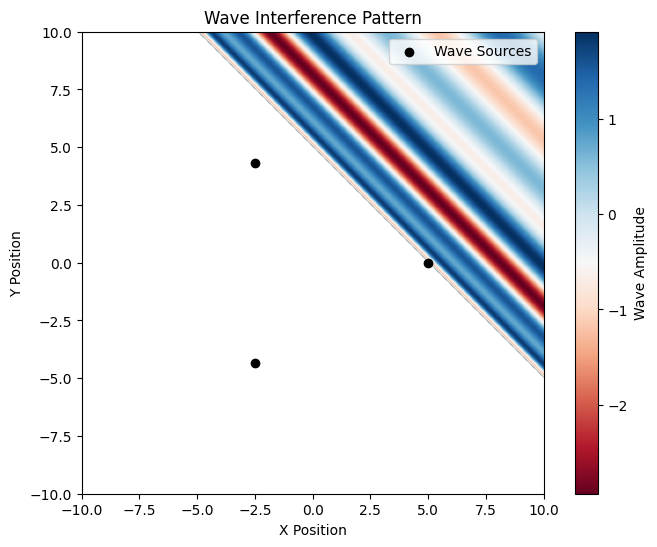

# Problem 1
## Solution Approach

### 1. Select a Regular Polygon
Let's choose a regular polygon with \( N = 5 \) vertices, such as a pentagon, for this solution. The vertices of a regular polygon are evenly spaced in a circle. The number of vertices can be adjusted later if needed.

### 2. Position the Sources
The sources will be placed at the vertices of the polygon, each of which can be represented in polar coordinates and then converted to Cartesian coordinates. For a regular polygon with \( N \) vertices, the angle between adjacent vertices is \( \frac{2\pi}{N} \).

### 3. Wave Equations
The wave emitted from each source can be described using the equation:

\[
\eta_i(x, y, t) = \frac{A}{r_i} \cos(k r_i - \omega t + \phi)
\]

Where:
- \( A \) is the amplitude,
- \( r_i = \sqrt{(x - x_i)^2 + (y - y_i)^2} \) is the distance between the source at \( (x_i, y_i) \) and the point \( (x, y) \),
- \( k = \frac{2\pi}{\lambda} \) is the wave number (depending on the wavelength),
- \( \omega = 2\pi f \) is the angular frequency (depending on the frequency),
- \( \phi \) is the initial phase.

### 4. Superposition of Waves
The total displacement at any point on the water surface will be the sum of the displacements from each point source:

\[
\eta_{\text{sum}}(x, y, t) = \sum_{i=1}^{N} \eta_i(x, y, t)
\]

This involves summing the displacement equations of all the point sources.

### 5. Analyze Interference Patterns
The interference patterns can be identified by examining regions where constructive interference (reinforcement of waves) and destructive interference (cancellation of waves) occur. These patterns depend on the distance between the sources, the wavelength, and the phase difference between the sources.

### 6. Visualization
We'll use Python and libraries like Matplotlib and NumPy to simulate the wave interactions and visualize the interference patterns.


```python

import numpy as np
import matplotlib.pyplot as plt

# Parameters
A = 1.0    # Amplitude of waves
wavelength = 1.0  # Wavelength of waves
k = 2 * np.pi / wavelength  # Wave number
f = 1.0    # Frequency of waves
omega = 2 * np.pi * f  # Angular frequency
t = 0  # Time snapshot

# Define polygon source positions (equilateral triangle as an example)
n_sources = 3  # Number of sources (vertices of polygon)
radius = 5  # Radius of the polygon
angles = np.linspace(0, 2 * np.pi, n_sources, endpoint=False)
source_positions = [(radius * np.cos(a), radius * np.sin(a)) for a in angles]

# Define spatial grid
x = np.linspace(-10, 10, 400)
y = np.linspace(-10, 10, 400)
X, Y = np.meshgrid(x, y)

# Compute wave superposition
wave_sum = np.zeros_like(X)
for x0, y0 in source_positions:
    r = np.sqrt((X - x0)*2 + (Y - y0)*2)
    wave_sum += A * np.cos(k * r - omega * t)

# Plot interference pattern
plt.figure(figsize=(8, 6))
plt.imshow(wave_sum, extent=[-10, 10, -10, 10], cmap='RdBu', origin='lower')
plt.colorbar(label='Wave Amplitude')
plt.title('Wave Interference Pattern')
plt.xlabel('X Position')
plt.ylabel('Y Position')
plt.scatter(*zip(*source_positions), color='black', marker='o', label='Wave Sources')
plt.legend()
plt.show()


```

