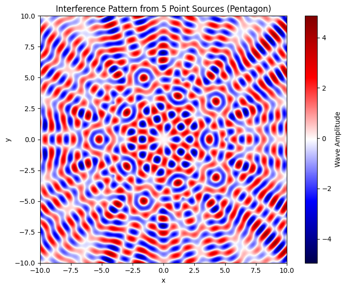
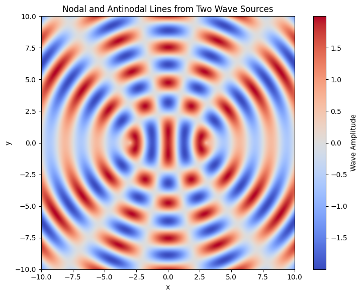
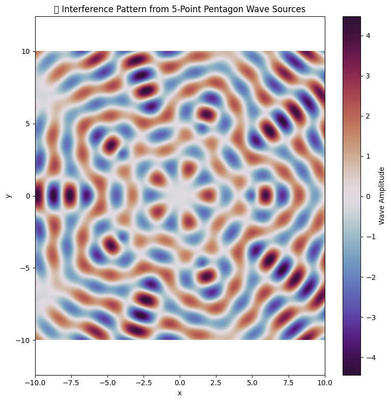

#  Interference Patterns on Water Surfaces

When waves generated from multiple sources interact on a water surface, they produce **interference patterns**. These are visual manifestations of the **superposition principle**, which states that overlapping wave disturbances add together algebraically to form a new wave pattern.

##  Types of Wave Interference

###  Constructive Interference
Occurs when wave peaks (crests) or troughs align, **amplifying** the overall displacement and producing **larger waves**.

###  Destructive Interference
Happens when a crest meets a trough, **reducing** or completely **canceling** the wave's displacement.

##  How Interference Is Observed

These patterns can be seen in controlled environments like a **ripple tank** or in natural settings such as:

- Raindrops hitting a still pond.
- Two objects dropped into water simultaneously.
- Reflected waves interacting with incoming waves near edges or obstacles.

The result is a series of repeating **bright (high-energy)** and **dim (low-energy)** zones, forming **rippling bands or curves**.

---

##  Pattern Features

- **Nodal Lines**: Boundaries of **destructive interference**—typically calm or unmoving.
- **Antinodal Lines**: Peaks of **constructive interference**—where motion is most intense.
- **Geometric Symmetry**: The interference pattern reflects the **symmetry of the wave sources**.

#  Interference from Polygonal Wave Sources

Now, let’s simulate wave interference from sources arranged at the vertices of a regular polygon. We'll use a **pentagon** for illustration.

---

## 1.  Choose a Polygon Shape

We select a **regular pentagon** with five vertices evenly spaced on a circle centered at the origin. The **radius \( R \)** defines the distance from the center to each source.

---

## 2.  Place the Wave Sources

Each source is positioned using the parametric equations:

\[
x_j = R \cdot \cos\left(\frac{2\pi j}{N}\right), \quad y_j = R \cdot \sin\left(\frac{2\pi j}{N}\right)
\]

Where:

- \( N = 5 \) (number of vertices/sources)
- \( j = 0, 1, 2, 3, 4 \)
- \( R = 5 \) (chosen radius)

---

## 3.  Wave Expression for Each Source

Every source emits a radial wave described by:

\[
\phi_j(x, y) = \sin(k \cdot d_j(x, y))
\]

Where:

- \( \phi_j \) is the wave from source \( j \)
- \( d_j(x, y) = \sqrt{(x - x_j)^2 + (y - y_j)^2} \)
- \( k = \frac{2\pi}{\lambda} \) is the wave number
- \( \lambda \) is the wavelength

---

## 4.  Compute Total Interference Pattern

Using the **principle of linear superposition**, the total wave at point \( (x, y) \) is:

\[
\Phi(x, y) = \sum_{j=0}^{N-1} \phi_j(x, y)
\]

This overall wave function \( \Phi(x, y) \) reveals the interference pattern created by the polygonal arrangement of wave sources.

##  Pattern Highlights

- **Pentagonal symmetry** due to the 5-point source layout
- Clear **nodal regions** (destructive interference zones)
- Intense **antinodal regions** (constructive interference zones)
- This creates a **visually striking 2D pattern**

##  Applications and Insights

These simulations deepen our understanding of:

- **Interference in optics** (e.g., multi-slit experiments)
- **Sound wave interference** and applications in **audio engineering**
- **Seismology** and the behavior of **earthquake waves**
- **Generative art** and **simulation-based design**

Studying wave interactions from **geometric source arrangements** helps reinforce foundational physics concepts and provides **visual tools** for analysis.
