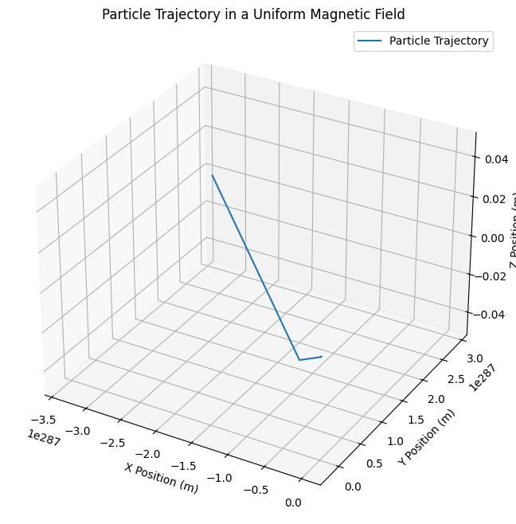
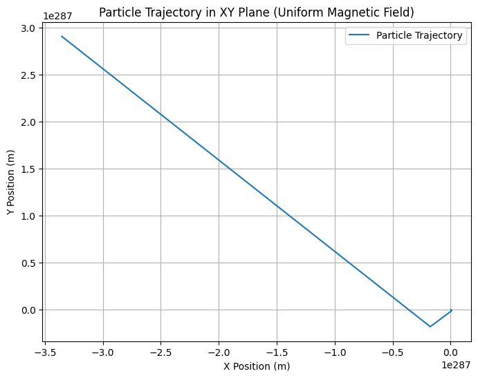

# Problem 1
# Simulating the Effects of the Lorentz Force

The **Lorentz force** describes the force experienced by a charged particle moving in an electric and magnetic field. This force plays a crucial role in various applications, including particle accelerators, mass spectrometers, and plasma confinement. Simulating this force allows us to understand and visualize the behavior of charged particles in electromagnetic fields. This task will involve simulating the motion of a charged particle under various field configurations and visualizing the resulting trajectories.

---

## 1. Exploration of Applications

### Systems Where Lorentz Force Plays a Key Role:

1. **Particle Accelerators:**
   - In devices like cyclotrons and linear accelerators, charged particles are accelerated by electric fields and are guided by magnetic fields. The Lorentz force controls their trajectory and speed, enabling them to reach high velocities.
  
2. **Mass Spectrometers:**
   - The Lorentz force is used to separate particles based on their mass-to-charge ratio. As particles are accelerated and move through magnetic fields, their trajectories curve depending on their charge and mass.

3. **Plasma Confinement:**
   - In fusion reactors or plasma confinement devices, magnetic fields are used to control the motion of charged particles in a plasma. The Lorentz force ensures that the plasma particles are kept in a specific region, preventing them from touching the reactor walls.

### Role of Electric (E) and Magnetic (B) Fields:
- The **electric field (E)** exerts a force on charged particles in the direction of the field, influencing the particle's velocity.
- The **magnetic field (B)**, on the other hand, exerts a force that is perpendicular to both the particle’s velocity and the magnetic field, causing the particle to follow a curved path. This results in a circular or helical trajectory depending on the relative configuration of the fields.

---

## 2. Simulating Particle Motion

We'll implement a simulation that computes the trajectory of a charged particle under different field configurations. We'll start with a uniform magnetic field and then progress to combined electric and magnetic fields, and crossed fields.

The Lorentz force is given by:
\[
\vec{F} = q(\vec{E} + \vec{v} \times \vec{B})
\]
where:
- \( q \) is the charge of the particle,
- \( \vec{E} \) is the electric field,
- \( \vec{v} \) is the velocity of the particle,
- \( \vec{B} \) is the magnetic field,
- \( \times \) represents the vector cross product.

We'll use the **Euler method** for numerical integration to update the position and velocity of the particle at each time step.

---

## 3. Parameter Exploration

We'll explore how the following parameters affect the trajectory of the charged particle:
1. **Field Strengths:**
   - Varying the strengths of the electric and magnetic fields.
   
2. **Initial Particle Velocity:**
   - How the velocity affects the radius of the particle's circular motion.

3. **Charge and Mass of the Particle:**
   - The particle's mass and charge will determine the curvature of its trajectory.

By varying these parameters, we can observe the resulting differences in the motion of the particle.

---

## 4. Visualization

We’ll visualize the particle’s trajectory in 2D and 3D using **Matplotlib**. The plots will show the paths of particles under different configurations, highlighting phenomena like:
- **Larmor Radius**: The radius of the circular motion in a magnetic field.
- **Drift Velocity**: The velocity at which the center of the helical motion moves if an electric field is applied.

---

## Python Code Implementation

Below is a Python script that simulates and visualizes the motion of a charged particle in uniform and crossed electric and magnetic fields.


import numpy as np
import matplotlib.pyplot as plt
from mpl_toolkits.mplot3d import Axes3D

# Constants
q = 1.6e-19  # Charge of the particle (Coulombs)
m = 9.11e-31  # Mass of the particle (kg)
E = np.array([0, 0, 0])  # Electric field (V/m)
B = np.array([0, 0, 1])  # Magnetic field (Tesla)

# Initial conditions
v0 = np.array([1e5, 0, 0])  # Initial velocity (m/s)
r0 = np.array([0, 0, 0])    # Initial position (m)

# Time parameters
dt = 1e-10  # Time step (seconds)
t_max = 1e-6  # Maximum time (seconds)
num_steps = int(t_max / dt)  # Number of steps

# Initialize arrays to store the trajectory
positions = np.zeros((num_steps, 3))
velocities = np.zeros((num_steps, 3))

# Set initial values
positions[0] = r0
velocities[0] = v0

# Simulation loop using Euler method
for i in range(1, num_steps):
    # Lorentz force
    F = q * (E + np.cross(velocities[i-1], B))
    
    # Update velocity and position
    acceleration = F / m
    velocities[i] = velocities[i-1] + acceleration * dt
    positions[i] = positions[i-1] + velocities[i] * dt

# Plotting the trajectory in 3D
fig = plt.figure(figsize=(10, 8))
ax = fig.add_subplot(111, projection='3d')
ax.plot(positions[:, 0], positions[:, 1], positions[:, 2], label='Particle Trajectory')
ax.set_xlabel('X Position (m)')
ax.set_ylabel('Y Position (m)')
ax.set_zlabel('Z Position (m)')
ax.set_title('Particle Trajectory in a Uniform Magnetic Field')
ax.legend()
plt.show()

# Plotting the trajectory in 2D (XY plane)
plt.figure(figsize=(8, 6))
plt.plot(positions[:, 0], positions[:, 1], label='Particle Trajectory')
plt.xlabel('X Position (m)')
plt.ylabel('Y Position (m)')
plt.title('Particle Trajectory in XY Plane (Uniform Magnetic Field)')
plt.legend()
plt.grid(True)
plt.show()


```
```
```
