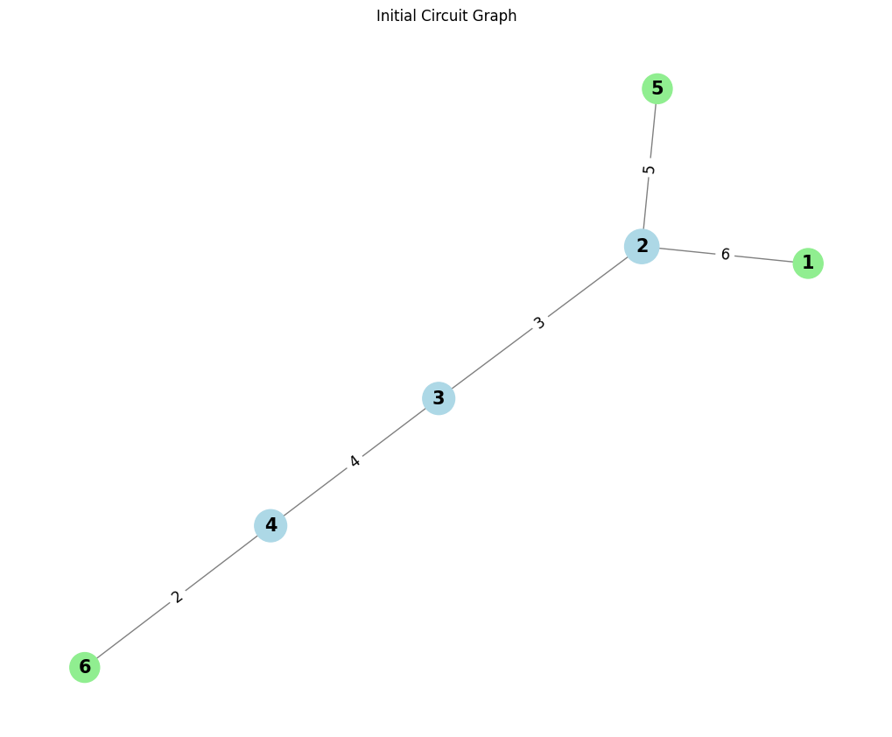

# Problem 1
# Equivalent Resistance Using Graph Theory

## Motivation:
### Challenge:
Calculating equivalent resistance in electrical circuits can be cumbersome, especially with complex resistor networks.

### Graph Theory Approach:
Represent the circuit as a graph to simplify the process of calculating the equivalent resistance.

- **Nodes** represent junctions (connection points).
- **Edges** represent resistors, with weights corresponding to their resistance values.

### Applications:
- Useful in circuit simulation software, optimization, and network design.

### Purpose:
Demonstrates how graph theory can streamline calculations, especially for complicated networks.

---


---

## Algorithm Description

### Graph Representation:
- **Nodes (vertices)** represent junctions.
- **Edges** represent resistors, with weights equal to their resistance values.

### Series and Parallel Combinations:

**Series:** Two resistors are in series if they are connected end-to-end with no intermediate junctions. Their combined resistance is the sum:  
R_{\text{eq}} = R_1 + R_2

**Parallel:** Two resistors are in parallel if both are connected between the same two nodes. The combined resistance is:  
\frac{1}{R_{\text{eq}}} = \frac{1}{R_1} + \frac{1}{R_2}


### Graph Simplification:

- **Series Reduction**: Replace two resistors in series with their sum.
- **Parallel Reduction**: Replace two resistors in parallel with their equivalent resistance.

### Iterative Process:
- Continuously reduce the graph by combining resistors in series or parallel until only one edge remains.

### Handle Nested Combinations:
- After each reduction, new series and parallel combinations may emerge. The algorithm should re-check the graph after each reduction.

## Pseudocode:

```python
def equivalent_resistance(circuit_graph):
    # Step 1: Initialize a graph G
    G = circuit_graph
    
    # Step 2: Detect series connections
    def reduce_series():
        for node in G:
            if G[node] has exactly two neighbors:
                # These two resistors are in series
                # Sum the resistances and replace the edge
                equivalent_resistance = sum_of_resistances
                G[node] = equivalent_resistance  # Update the edge
    
    # Step 3: Detect parallel connections
    def reduce_parallel():
        for edge in G.edges:
            u, v = edge
            if G[u] and G[v] are connected with multiple resistors:
                # These resistors are in parallel
                # Calculate the equivalent resistance using the parallel formula
                parallel_resistance = 1 / (1 / R1 + 1 / R2)
                G[u][v] = parallel_resistance  # Update the edge
    
    # Step 4: Simplify graph
    while len(G.edges) > 1:
        reduce_series()  # Reduce series connections
        reduce_parallel()  # Reduce parallel connections
    
    # Step 5: Return the final equivalent resistance
    return G[remaining_edge]  # The final resistance is in the last remaining edge

## Explanation of the Algorithm:

### Graph Representation:
We use an adjacency list or matrix to represent the graph. The nodes (junctions) are connected by edges, which have resistance values as weights.

### Series Reduction:
We look for pairs of resistors connected in series by checking if two resistors are connected directly with no branching in between.

### Parallel Reduction:
We check for pairs of resistors connected in parallel by checking if they are both connected between the same pair of nodes.

### Iterative Process:
After each reduction, the graph is updated, and the algorithm rechecks the graph for possible new reductions. This process continues until we are left with a single equivalent resistance.


## Handling Complex Circuits:
The algorithm simplifies the circuit step-by-step. In complex circuits, you will need to detect combinations that might not be immediately obvious. This requires a combination of **depth-first search (DFS)** or **breadth-first search (BFS)** to explore and detect these patterns.


## Efficiency and Improvements:

### Time Complexity:
The complexity mainly depends on the size of the graph and the number of iterations needed to reduce the circuit. For each iteration, we are checking all edges, leading to a time complexity of \( O(E) \), where \( E \) is the number of edges.

### Optimization:
We can optimize the algorithm by maintaining auxiliary data structures to track the current state of the graph and avoid redundant calculations.

### Cycle Detection:
For more advanced circuits with cycles, we can use graph traversal techniques to detect and reduce these cycles effectively.


### Graph Representation:

#### Nodes:
- 1, 2, 3, 4, 5, 6

#### Edges:
- (1, 2, \( R_1 = 6 \, \Omega \))
- (2, 3, \( R_2 = 3 \, \Omega \))
- (3, 4, \( R_3 = 4 \, \Omega \))
- (2, 5, \( R_4 = 5 \, \Omega \))
- (4, 6, \( R_5 = 2 \, \Omega \))


import networkx as nx
import matplotlib.pyplot as plt

# Function to plot the graph for visualization
def plot_graph(G, title="Circuit Graph"):
    pos = nx.spring_layout(G)  # Layout for better visualization
    plt.figure(figsize=(10, 8))
    node_size = [500 + 100 * G.degree(node) for node in G.nodes]
    node_color = ['lightgreen' if G.degree(node) == 1 else 'lightblue' for node in G.nodes]
    nx.draw(G, pos, with_labels=True, node_color=node_color, node_size=node_size, font_size=15, font_weight="bold", edge_color="gray")

    edge_labels = nx.get_edge_attributes(G, 'weight')
    nx.draw_networkx_edge_labels(G, pos, edge_labels=edge_labels, font_size=12)

    plt.title(title)
    plt.axis('off')  # Hide axes for a cleaner presentation
    plt.show()

# Function to find series resistors
def find_series_resistors(G):
    series_pairs = []
    for node in G.nodes:
        neighbors = list(G.neighbors(node))

        if len(neighbors) == 2:  # Exactly two neighbors for series connection
            R1 = G[node][neighbors[0]]['weight']
            R2 = G[node][neighbors[1]]['weight']
            if R1 is not None and R2 is not None:
                series_pairs.append((node, neighbors[0], neighbors[1]))  # (center_node, neighbor1, neighbor2)
    return series_pairs

# Function to find parallel resistors
def find_parallel_resistors(G):
    parallel_pairs = []
    for node in G.nodes:
        neighbors = list(G.neighbors(node))

        if len(neighbors) == 2:  # Exactly two neighbors for parallel connection
            R1 = G[node][neighbors[0]]['weight']
            R2 = G[node][neighbors[1]]['weight']
            if R1 is not None and R2 is not None:
                parallel_pairs.append((neighbors[0], node, neighbors[1]))  # (node1, center_node, node2)
    return parallel_pairs

# Function to simplify a series resistor
def simplify_series(G, series_pair):
    node1, node2, node3 = series_pair
    R1 = G[node2][node1]['weight']
    R2 = G[node3][node2]['weight']
    R_eq = R1 + R2  # Series combination

    # Remove the two resistors and add the equivalent one
    G.remove_edge(node2, node1)
    G.remove_edge(node3, node2)
    G.add_edge(node1, node3, weight=R_eq)
    return G

# Function to simplify a parallel resistor
def simplify_parallel(G, parallel_pair):
    node1, node2, node3 = parallel_pair
    R1 = G[node1][node2]['weight']
    R2 = G[node2][node3]['weight']
    R_eq = 1 / (1 / R1 + 1 / R2)  # Parallel combination

    # Remove the two resistors and add the equivalent one
    G.remove_edge(node1, node2)
    G.remove_edge(node2, node3)
    G.add_edge(node1, node3, weight=R_eq)
    return G

# Main function to calculate equivalent resistance
def calculate_equivalent_resistance(G):
    # Initial graph plot
    plot_graph(G, title="Initial Circuit Graph")

    step = 1
    # Keep simplifying the graph until only one edge remains
    while len(G.edges) > 1:
        # Simplify series connections
        series_pairs = find_series_resistors(G)
        if series_pairs:
            print(f"Step {step}: Simplifying series pairs: {series_pairs}")
        for series_pair in series_pairs:
            G = simplify_series(G, series_pair)

        # Plot after simplifying series resistors
        plot_graph(G, title=f"After Step {step}: Simplified Series Resistors")

        # Simplify parallel connections
        parallel_pairs = find_parallel_resistors(G)
        if parallel_pairs:
            print(f"Step {step}: Simplifying parallel pairs: {parallel_pairs}")
        for parallel_pair in parallel_pairs:
            G = simplify_parallel(G, parallel_pair)

        # Plot after simplifying parallel resistors
        plot_graph(G, title=f"After Step {step}: Simplified Parallel Resistors")

        step += 1

    # The final equivalent resistance is the only edge left in the graph
    final_resistance = None
    for edge in G.edges(data=True):
        final_resistance = edge[2]['weight']

    return final_resistance

# Example usage: Create a circuit graph
G = nx.Graph()

# Adding resistors (edges) to the circuit
# Resistor values: R1 = 6 ohms, R2 = 3 ohms, R3 = 4 ohms, R4 = 5 ohms, R5 = 2 ohms
G.add_edge(1, 2, weight=6)  # R1
G.add_edge(2, 3, weight=3)  # R2
G.add_edge(3, 4, weight=4)  # R3
G.add_edge(2, 5, weight=5)  # R4
G.add_edge(4, 6, weight=2)  # R5

# Call the function to calculate the equivalent resistance
equivalent_resistance = calculate_equivalent_resistance(G)
print(f"The equivalent resistance of the circuit is: {equivalent_resistance:.2f} ohms")


```

