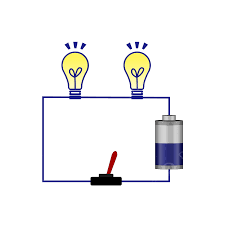
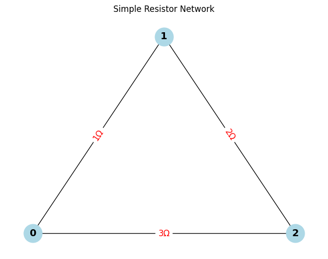
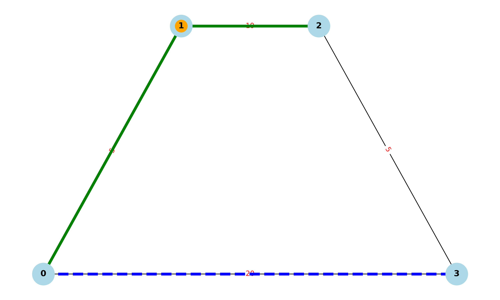

# What is an Electric Circuit?

An **electric circuit** is a closed path that enables **electric current** to flow. It generally consists of:

- A **power source** (e.g., battery or generator)
- **Conductive wires** for carrying the current
- One or more **electrical components** (e.g., resistors, switches, bulbs)

> ✅ A circuit must be **complete** and **unbroken** to function — allowing charges to circulate continuously.



---

# Calculating Equivalent Resistance Using Graph Theory

In **graph theory**, a resistor network can be represented as a graph where:

- **Nodes (vertices)** = circuit junctions
- **Edges** = resistors (edge weight = resistance)

## Method Overview

1. **Model** the circuit as an undirected weighted graph.
2. **Construct the conductance matrix** (1/R for each resistor).
3. **Build the Laplacian matrix** `L`:
   - `L = D - A`
   - `D`: Degree matrix (sum of conductances at each node)
   - `A`: Adjacency matrix (using conductance values)
4. Use the **Moore-Penrose pseudoinverse** of `L` (denoted `L⁺`) to compute:
   ```math
   R_eq(a, b) = L⁺[a,a] + L⁺[b,b] - 2 * L⁺[a,b]

 

Function CalculateEquivalentResistance(graph, node_start, node_end):
While number of edges > 1:
For each node N in graph:

            # --- Series Reduction ---
            If N has exactly two neighbors (A and B) and N is not start or end:
                R1 = resistance between N and A
                R2 = resistance between N and B
                Replace edges (A-N) and (N-B) with a single edge (A-B) of resistance R1 + R2
                Remove node N

            # --- Parallel Reduction ---
            For each pair of nodes (U, V) with multiple edges:
                Combine all resistors R1, R2, ..., Rn between U and V
                R_parallel = 1 / (1/R1 + 1/R2 + ... + 1/Rn)
                Replace multiple edges with a single edge (U-V) of resistance R_parallel

    Return resistance between node_start and node_end

    ## Pseudocode Explanation: Series and Parallel Resistor Reduction

This pseudocode outlines an algorithm to compute the **equivalent resistance** between two nodes in a resistor network by identifying and reducing **series** and **parallel** connections.

 