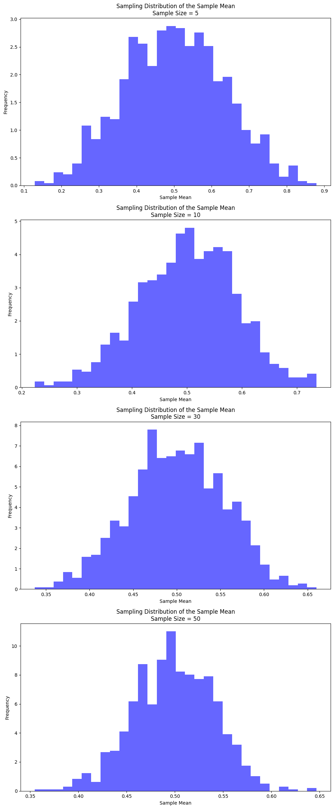
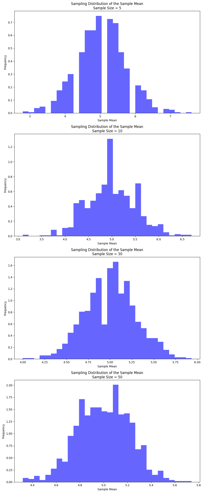

# Problem 1
# Exploring the Central Limit Theorem through Simulations

## Motivation
The Central Limit Theorem (CLT) is a cornerstone of probability and statistics, stating that the sampling distribution of the sample mean approaches a normal distribution as the sample size increases, regardless of the population’s original distribution. Simulations provide an intuitive and hands-on way to observe this phenomenon in action.

## Task Overview

### 1. Simulating Sampling Distributions

#### Step 1: Choose Populations
We will simulate three different types of population distributions:

1. **Uniform Distribution**: Every number within a given range has an equal chance of being selected.
2. **Exponential Distribution**: The population follows an exponential decay pattern, commonly used in scenarios like waiting times.
3. **Binomial Distribution**: A distribution representing the number of successes in a fixed number of independent trials, such as the number of heads in a series of coin flips.

#### Step 2: Generate a Large Population Dataset
For each of the above distributions, we will generate a large dataset that represents our population. This large dataset will then be used to draw random samples for our simulation.

### 2. Sampling and Visualization

#### Step 1: Sampling
For each distribution, we will:
1. Randomly sample data from the population with different sample sizes (5, 10, 30, 50).
2. Calculate the sample mean for each sample drawn.
3. Repeat the sampling process multiple times (e.g., 1,000 times) to create a distribution of sample means.

#### Step 2: Visualizing the Sampling Distribution
We will plot histograms of the sample means for each sample size and observe the convergence to a normal distribution. For larger sample sizes, we expect the histogram to look more normal, in line with the Central Limit Theorem.

### 3. Parameter Exploration

We'll investigate the following factors:
1. **Effect of Population Shape**: How does the shape of the original population (uniform, exponential, binomial) affect the sampling distribution's convergence to normality?
2. **Effect of Sample Size**: As the sample size increases, how does the sampling distribution of the sample mean approach normality?
3. **Variance**: We'll observe how the variance of the population affects the spread of the sampling distribution.

### 4. Practical Applications
Reflecting on the significance of CLT:
- **Estimating Population Parameters**: Understanding how sample means approximate population means as sample size grows.
- **Quality Control**: In manufacturing, the CLT helps in determining acceptable ranges for product features and predicting defects.
- **Financial Models**: CLT is crucial for understanding risk and predicting stock prices and returns.

### 5. Deliverables

- **Markdown Document**: Documenting the task, explaining the CLT, describing the simulation process, and interpreting the results.
- **Python Scripts/Notebooks**: A script or notebook that performs the simulations and visualizations.
- **Plots**: Histograms showing how the sampling distributions of the sample mean converge to normal as sample size increases.

### Key Insights from Simulations:
- **Uniform Distribution**: As sample size increases, the distribution of the sample mean will approach a normal distribution, even though the uniform distribution is not normal.
- **Exponential Distribution**: Even though the exponential distribution is skewed, the sampling distribution of the mean will approach normality as the sample size increases.
- **Binomial Distribution**: For large sample sizes, the binomial distribution (which is discrete) will also approximate a normal distribution, as per the CLT.

By running the simulations and observing the results, we can better understand how the CLT works and how the sample size and population shape affect the convergence to a normal distribution.


```
```

```
```


