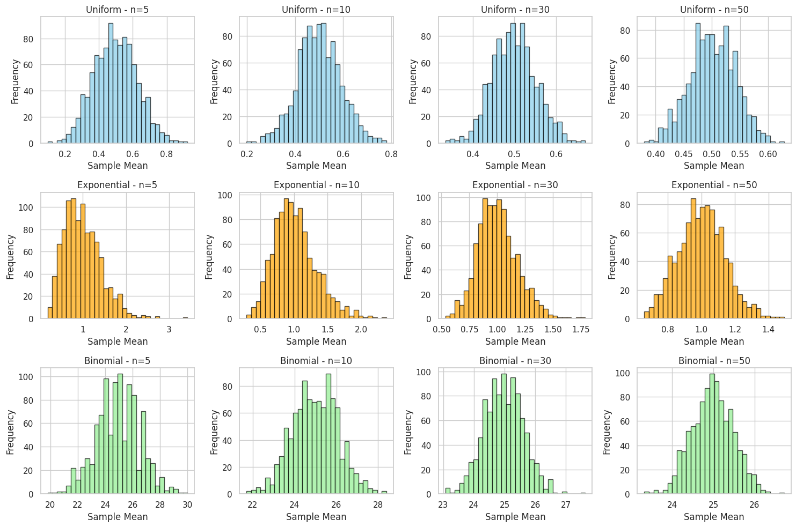

#  Central Limit Theorem and Sampling Distributions

The **Central Limit Theorem (CLT)** states that the distribution of sample means approximates a normal distribution, even if the underlying population is not normal—as long as the sample size is sufficiently large. This phenomenon is crucial in statistics, enabling confident use of normal models in real-world problems.

##  Core Idea of the CLT

If we take repeated samples from any population and compute their means:

- The mean of the sampling distribution will approach the population mean \( \mu \).
  
- The spread (standard deviation) of the sample means becomes:

  \[
  \sigma_{\overline{x}} = \frac{\sigma}{\sqrt{n}}
  \]

  where:

  - \( \sigma \) is the population standard deviation
  - \( n \) is the sample size

As \( n \to \infty \), the shape of the sampling distribution becomes increasingly bell-shaped (normal)—even if the population distribution is skewed or discrete.

# How CLT Is Observed Through Simulation

Simulations help us visualize and confirm the Central Limit Theorem (CLT) using different populations and sample sizes.

## 1. Define Population Distributions
We simulate from a few common types:

- ** Uniform Distribution**: Equal probability across all values.
- ** Exponential Distribution**: Skewed right, with most values near zero.
- ** Binomial Distribution**: Discrete outcomes, such as coin flips.

From each, generate a large dataset (e.g., 10,000 points) to represent the population.

## 2. Generate Sampling Distributions
For each distribution:

- Take repeated samples of size \( n = 5, 10, 30, 50 \).
- Compute the sample mean \( \bar{x} \).
- Repeat many times (e.g., 1000) to build a sampling distribution.

These sampling distributions are then visualized using histograms.

## 3. Mathematical Behavior of Convergence
Each sample mean \( \bar{x}_i \) from a sample of size \( n \) is:

\[
\bar{x}_i = \frac{1}{n} \sum_{j=1}^{n} x_{ij}
\]

- The mean of the sampling distribution:  
  \[
  E[\bar{X}] = \mu
  \]
- The variance of the sampling distribution:  
  \[
  \text{Var}(\bar{X}) = \frac{\sigma^2}{n}
  \]
- The distribution of \( \bar{X} \) tends toward:  
  \[
  \bar{X} \sim N\left(\mu, \frac{\sigma^2}{n}\right)
  \]
  as \( n \) increases.

#  Pattern Features

- **Skewed Start**: Small sample sizes reflect the skew of the original population.
- **Symmetry Emerges**: As sample size increases, the sampling distribution becomes more symmetric and normal.
- **Variance Shrinks**: The spread (standard error) reduces with larger \( n \), clustering values around the mean.

#  Visual Highlights from Simulation

Using code to simulate:

-  Sample means from an exponential distribution still produce a normal-looking histogram for \( n \geq 30 \).
-  Even when the original data is skewed or jagged, the means smooth out.

This aligns beautifully with CLT predictions.

#  Applications and Insights

Understanding the Central Limit Theorem (CLT) is crucial in:

- ** Estimating population means from sample data**
- ** Quality control and process improvement in manufacturing**
- ** Polling and survey analysis**
- ** Financial risk modeling and forecasting**
- ** Simulated data modeling in generative design**

The CLT provides a mathematical bridge from raw data to inferential statistics, showing how large samples "normalize" even chaotic sources.
