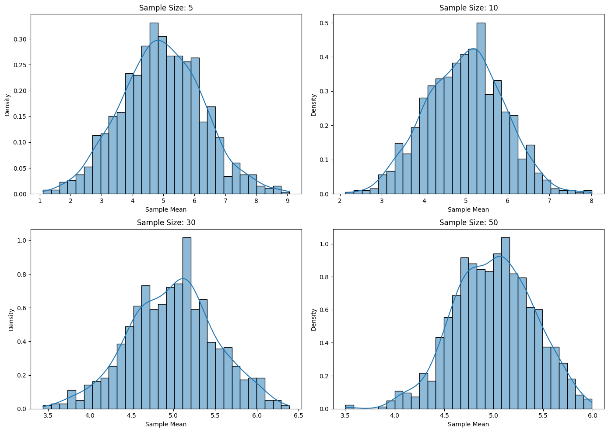

# Problem 1
# Exploring the Central Limit Theorem through Simulations

## Motivation

The **Central Limit Theorem (CLT)** states that the sampling distribution of the sample mean will approach a normal distribution as the sample size increases, regardless of the original population distribution. This fundamental concept in statistics allows us to make inferences about population parameters using sample data.

## Objective

The objective is to simulate and visualize the Central Limit Theorem (CLT) through different population distributions to observe how the sampling distribution of the sample mean converges to a normal distribution as the sample size increases.

## Task Breakdown

### 1. Simulating Sampling Distributions

#### Population Distributions:
Select several population distributions to simulate:
1. **Uniform Distribution**: All values within a specified range have an equal probability of being chosen.
2. **Exponential Distribution**: Follows an exponential decay pattern, commonly used to model waiting times.
3. **Binomial Distribution**: Represents the number of successes in a fixed number of trials (e.g., number of heads in a series of coin flips).

**Step 1**: Generate a large dataset for each of these distributions to represent the population.

### 2. Sampling and Visualization

#### Sampling Process:
1. **Random Sampling**: Randomly sample from the generated population data.
2. **Sample Mean Calculation**: For each sample, calculate the sample mean.
3. **Multiple Sampling**: Repeat the sampling process multiple times (e.g., 1,000 repetitions) for different sample sizes (e.g., 5, 10, 30, 50).

#### Visualization:
- Plot histograms of the sample means for each sample size.
- Observe the convergence to normality: As the sample size increases, the distribution of the sample means should approach a normal distribution.

### 3. Parameter Exploration

#### Exploration of Factors:
1. **Effect of Population Shape**: Investigate how the shape of the original population (uniform, exponential, binomial) affects the convergence of the sampling distribution to normality.
2. **Effect of Sample Size**: Study how the sample size influences the convergence of the sampling distribution to a normal distribution.
3. **Effect of Variance**: Observe how the population variance affects the spread of the sampling distribution of the sample mean.

### 4. Practical Applications

#### Real-World Implications of the Central Limit Theorem:
1. **Estimating Population Parameters**: CLT helps in using sample means to approximate the population mean. As sample size increases, sample means become more accurate estimators of the population mean.
2. **Quality Control**: In manufacturing, the CLT allows for prediction and monitoring of product quality by sampling and analyzing sample data.
3. **Financial Models**: CLT is crucial for understanding risk in finance, helping to predict stock prices, returns, and other financial metrics by treating sample means as approximations of true population values.

---

By simulating different population distributions and observing the convergence of the sampling distribution of the sample mean to normality, we can deepen our understanding of the Central Limit Theorem and its significance in various fields, including statistics, quality control, and finance.


```python
# Importing necessary libraries
import numpy as np
import matplotlib.pyplot as plt
import seaborn as sns

# Set random seed for reproducibility
np.random.seed(42)

# Population size
population_size = 100000

# 1. Uniform Distribution (Range from 0 to 10)
uniform_population = np.random.uniform(low=0, high=10, size=population_size)

# 2. Exponential Distribution (Scale parameter 2)
exponential_population = np.random.exponential(scale=2, size=population_size)

# 3. Binomial Distribution (10 trials, 0.5 probability of success)
binomial_population = np.random.binomial(n=10, p=0.5, size=population_size)

# Function to calculate sample means
def sample_means(population, sample_size, n_samples):
    """Returns a list of sample means from random samples of given size."""
    sample_means = []
    for _ in range(n_samples):
        sample = np.random.choice(population, size=sample_size)
        sample_means.append(np.mean(sample))
    return sample_means

# Function to plot the sampling distribution of sample means
def plot_sampling_distribution(population, sample_sizes, n_samples=1000):
    """Plots histograms of sample means for different sample sizes."""
    plt.figure(figsize=(14, 10))

    for i, sample_size in enumerate(sample_sizes):
        sample_means_values = sample_means(population, sample_size, n_samples)
        plt.subplot(2, 2, i + 1)
        sns.histplot(sample_means_values, kde=True, stat="density", bins=30)
        plt.title(f"Sample Size: {sample_size}")
        plt.xlabel('Sample Mean')
        plt.ylabel('Density')

    plt.tight_layout()
    plt.show()

# Sample sizes to consider
sample_sizes = [5, 10, 30, 50]

# Visualize sampling distributions for each population
print("Uniform Distribution Sampling Distributions:")
plot_sampling_distribution(uniform_population, sample_sizes)

print("Exponential Distribution Sampling Distributions:")
plot_sampling_distribution(exponential_population, sample_sizes)

print("Binomial Distribution Sampling Distributions:")
plot_sampling_distribution(binomial_population, sample_sizes)

# Function to calculate and print variance of sample means
def variance_of_sample_means(population, sample_sizes, n_samples=1000):
    """Calculates and prints the variance of sample means for different sample sizes."""
    for sample_size in sample_sizes:
        sample_means_values = sample_means(population, sample_size, n_samples)
        print(f"Sample Size: {sample_size} -> Variance of Sample Means: {np.var(sample_means_values)}")

# Calculate and display variance for each population
print("\nVariance of Sample Means for Uniform Distribution:")
variance_of_sample_means(uniform_population, sample_sizes)

print("\nVariance of Sample Means for Exponential Distribution:")
variance_of_sample_means(exponential_population, sample_sizes)

print("\nVariance of Sample Means for Binomial Distribution:")
variance_of_sample_means(binomial_population, sample_sizes)

```
