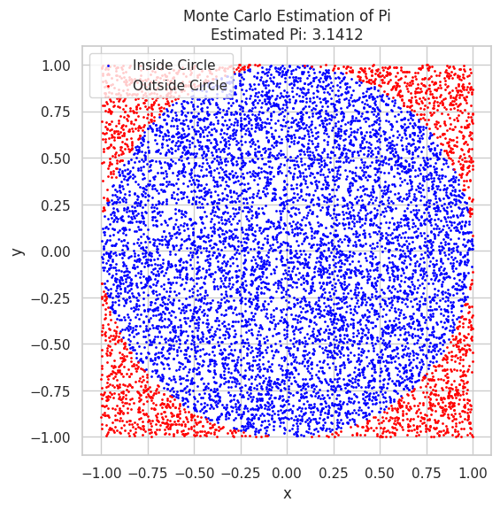
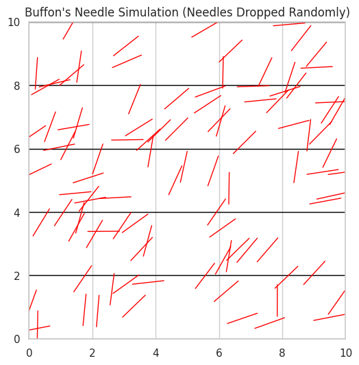

# Estimating Pi Using Monte Carlo Methods

## Motivation

Monte Carlo simulations are a class of computational techniques that use randomness and statistical sampling to solve problems or estimate values. One of the most elegant and visually engaging applications of Monte Carlo methods is estimating the value of \( \pi \) through geometric probability. By randomly generating points and analyzing their positions relative to a geometric shape, we can approximate \( \pi \). This approach connects fundamental concepts of probability, geometry, and numerical computation, offering an intuitive way to explore the convergence properties of Monte Carlo methods and their practical application in various fields such as physics, finance, and computer science.

The Monte Carlo method of estimating \( \pi \) exemplifies the power of randomness in computation, highlighting the versatility and simplicity of this technique. It also provides insight into how randomness can be harnessed to solve problems that would otherwise be computationally complex.

---

## Task

### Part 1: Estimating \( \pi \) Using a Circle

#### 1. Theoretical Foundation

The principle behind estimating \( \pi \) using a circle involves understanding the relationship between the area of a circle and a square. Consider a circle with a radius of 1 inscribed within a square, where the side length of the square is also 2 (since the circle’s diameter is 2). The area of the square is \( 2^2 = 4 \), and the area of the unit circle is \( \pi \times 1^2 = \pi \). The key idea is to use random points within the square and count how many of those points fall within the circle. 

Since the area of the circle and the square are related by \( \pi \) and the total area of the square, the ratio of the number of points inside the circle to the total number of points within the square can be used to estimate \( \pi \). Specifically, if we generate random points inside the square and count how many fall inside the circle, we can use the following formula to estimate \( \pi \):

\[
\pi \approx 4 \times \left( \frac{\text{points inside the circle}}{\text{total points}} \right)
\]

This formula comes from the fact that the ratio of the area of the circle to the area of the square is \( \frac{\pi}{4} \), and thus the ratio of points inside the circle to the total points should approach \( \frac{\pi}{4} \) as the number of points increases.

#### 2. Simulation

The next step is to generate random points within the square and check how many fall inside the circle. To do this, we use the equation for a circle:

\[
x^2 + y^2 \leq 1
\]

where \( (x, y) \) are the coordinates of the randomly generated point. If this condition is satisfied, the point lies inside the circle. By repeating this process for a large number of points, we can estimate \( \pi \) based on the ratio of points inside the circle to the total points. As the number of points increases, the estimate of \( \pi \) should become more accurate.

#### 3. Visualization

In the simulation, we can visualize the randomly generated points, distinguishing between those that fall inside the circle and those that fall outside. The points inside the circle can be plotted in one color (e.g., blue), while the points outside the circle can be plotted in another color (e.g., red). This visualization helps us intuitively understand how the accuracy of the \( \pi \)-estimation improves as we generate more points.

# Estimate Pi
pi_estimate = 4 * np.sum(inside_circle) / N
print(f"Estimated Pi: {pi_estimate}")

### 4. Analysis

As the number of points increases, the estimate of \( \pi \) becomes more accurate. This convergence is an important feature of the Monte Carlo method. Initially, the estimate of \( \pi \) may vary significantly with each run, but as the number of random points increases, the estimate stabilizes around the true value of \( \pi \). The rate of convergence can be analyzed through the law of large numbers, which states that the average of a large number of independent and identically distributed random variables will converge to the expected value.

The computational cost of this method scales linearly with the number of points generated. This makes it a relatively simple and efficient approach to estimating \( \pi \), although it is not the fastest for extremely high precision, where analytical methods like the Leibniz formula for \( \pi \) or using series expansions may be more effective.

---

### Part 2: Estimating \( \pi \) Using Buffon’s Needle

#### 1. Theoretical Foundation

Buffon’s Needle problem provides another fascinating way to estimate \( \pi \) through geometric probability. The problem involves a needle of length \( l \) being dropped onto a plane with parallel lines spaced a distance \( d \) apart. The probability that the needle crosses one of the lines is related to \( \pi \), and through this relationship, we can derive an estimate for \( \pi \).

The formula for estimating \( \pi \) from Buffon’s Needle is:

\[
\pi \approx \frac{2 \times d \times \text{number of crossings}}{l \times \text{number of throws}}
\]

This formula is derived from the geometric properties of the needle and the lines, where \( \pi \) emerges from the ratio of the number of times the needle crosses a line to the total number of throws. This method requires simulating the random dropping of the needle and counting the number of crossings to estimate \( \pi \).

#### 2. Simulation

To simulate the problem, we randomly generate the position and angle of the needle for each throw. The position and angle determine whether the needle crosses a line. If the needle crosses a line, we increment the count of crossings. After a large number of throws, we can apply the formula to estimate \( \pi \).

### 3. Visualization

We can visualize the simulation by randomly dropping the needle on a set of parallel lines. For each throw, we can display the position and orientation of the needle relative to the lines, indicating whether it crosses a line.

---

### 4. Analysis

The accuracy of the \( \pi \) estimate improves as the number of throws increases. This convergence, however, tends to be slower than the circle-based method due to the larger number of variables involved in determining whether the needle crosses a line. Nonetheless, Buffon’s Needle offers a novel and intriguing approach to estimating \( \pi \) and demonstrates the connection between geometry, probability, and randomness.

---

### Conclusion

Both the Monte Carlo circle method and Buffon’s Needle provide fascinating ways to estimate \( \pi \). These methods illustrate the power of random sampling in estimating mathematical constants and highlight the intersection of geometry and probability in computational techniques. While the circle-based approach offers a relatively simple and fast convergence to the true value of \( \pi \), Buffon’s Needle provides a more complex, albeit slower, method that still relies on the randomness of the process. Both techniques are excellent examples of how randomness and probability can be employed to solve mathematical problems with remarkable accuracy.
