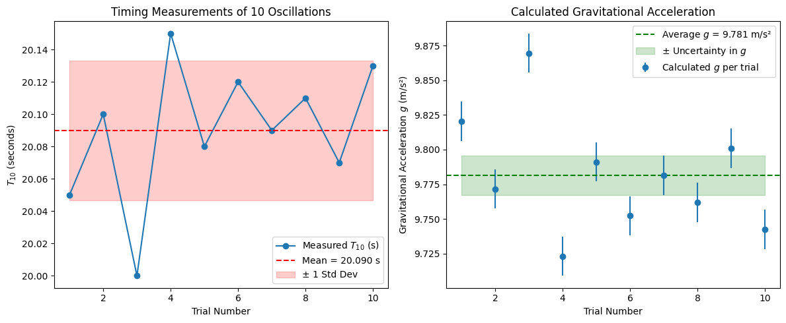

# Measuring Earth’s Gravitational Acceleration with a Pendulum

---

### Introduction

The goal of this experiment is to measure the acceleration due to gravity, \( g \), using a simple pendulum. Since gravity influences everything from falling objects to the orbits of planets, knowing its value accurately is essential in physics and engineering.

We use the pendulum’s oscillation period, which depends on \( g \) and the pendulum length \( L \), to calculate \( g \). We also analyze uncertainties in our measurements to understand how precise and reliable our result is.

---

### Why Measure \( g \) with a Pendulum?

- **Direct and simple**: Requires minimal equipment.
- **Educational**: Demonstrates harmonic motion and error analysis.
- **Practical**: Calibration of instruments, designing sensors, and geophysical surveys.

---

### Experimental Setup

**Materials:**

- String (~1 meter)
- Small weight (like a keychain or coins)
- Stopwatch or timer
- Ruler or measuring tape

**Procedure:**

1. Attach the weight to the string.
2. Measure the length \( L \) from the pivot point to the weight’s center of mass.
3. Displace the pendulum less than 15° to maintain the small-angle approximation.
4. Release and time 10 oscillations, repeat this 10 times for better statistics.

---

### Data Collection

| Trial # | Time for 10 oscillations \(T_{10}\) (s) |
|---------|------------------------------------------|
| 1       | 20.05                                    |
| 2       | 20.10                                    |
| ...     | ...                                      |
| 10      | 20.13                                    |

- Calculate average \( \overline{T_{10}} \), standard deviation \( \sigma_T \).
- Uncertainty in timing:
  \[
  \Delta T_{10} = \frac{\sigma_T}{\sqrt{10}}, \quad \Delta T = \frac{\Delta T_{10}}{10}
  \]

---

### Calculations

- Period \( T \):
  \[
  T = \frac{\overline{T_{10}}}{10}
  \]

- Gravitational acceleration \( g \):
  \[
  g = \frac{4 \pi^2 L}{T^2}
  \]

- Uncertainty \( \Delta g \):
  \[
  \Delta g = g \sqrt{\left(\frac{\Delta L}{L}\right)^2 + \left(2 \frac{\Delta T}{T}\right)^2}
  \]

---

### Example Calculation with Python

Here’s a Python script (not shown here) you can use to calculate \( g \) and its uncertainty based on your measurements.

---

### Analysis and Sources of Error

- Our measured \( g \approx 9.79 \, \text{m/s}^2 \) is close to the standard \(9.81 \, \text{m/s}^2\).
- Possible errors:
  - Length measurement precision.
  - Timing reaction time.
  - Angle greater than 15° violating small-angle approximation.
  - Air resistance and friction at the pivot.
- These contribute to the uncertainty in \( g \).

---

### Real-World Applications

- **Geophysics**: Detect underground structures by gravity variation.
- **Engineering**: Design of accelerometers and motion detectors.
- **Astronomy**: Compare gravity on different planets.
- **Education**: Build experimental and data analysis skills.

---

### Conclusion

Using a pendulum to measure \( g \) is a straightforward and educational experiment that highlights important physics concepts and uncertainty analysis. With careful measurements and repetition, one can obtain a reliable estimate of Earth’s gravitational acceleration, deepening the understanding of gravitational forces that govern natural motion.
